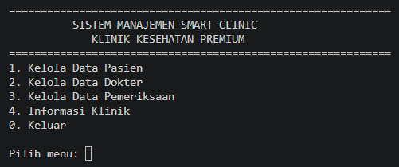

# LAPORAN POSTTEST OOP -- SMART CLINIC

## Identitas

**Nama:** Ahmad Aril Fadillah.B\
**NIM:** 2509106119\
**Judul Program:** Sistem Manajemen Smart Clinic\
**Bahasa Pemrograman:** Python

------------------------------------------------------------------------

# 1. Deskripsi Program

Program **Smart Clinic** merupakan program berbasis Object-Oriented
Programming (OOP) yang digunakan untuk mengelola data klinik kesehatan.

Program menyediakan pengelolaan beberapa data utama, yaitu:

-   Data pasien
-   Data dokter
-   Data pemeriksaan
-   Informasi klinik
-   Data tenaga medis

Program juga menerapkan konsep OOP yang dipelajari pada posttest, yaitu:

1.  Relasi UML
    -   Asosiasi
    -   Agregasi
    -   Komposisi
2.  Inheritance
    -   Superclass dan subclass
    -   `super().__init__()`
    -   Atribut khusus subclass
    -   Method overriding
    -   Protected
    -   Private

------------------------------------------------------------------------

# 2. Tujuan Program

Tujuan pembuatan program Smart Clinic adalah:

1.  Menerapkan konsep Object-Oriented Programming ke dalam sebuah kasus
    nyata.
2.  Mengelola data pasien, dokter, dan pemeriksaan.
3.  Menerapkan hubungan antar-class menggunakan konsep Relasi UML.
4.  Menerapkan konsep inheritance dengan superclass dan subclass.
5.  Memahami penggunaan protected dan private attribute.
6.  Menerapkan method overriding pada subclass.
7.  Membuat program yang dapat melakukan proses CRUD.

------------------------------------------------------------------------

# 3. Struktur Class

Program menggunakan beberapa class utama.

``` text
Smart Clinic
│
├── Pasien
│
├── Dokter
│
├── Perawat
│
├── TenagaMedis
│
├── Pemeriksaan
│
├── RekamMedis
│
└── Klinik
```

Hubungan inheritance:

``` text
                 TenagaMedis
                 /          \
                /            \
            Dokter          Perawat
```

Relasi UML:

``` text
Pasien ───── Pemeriksaan ───── Dokter

Klinik ◇──── Pasien
Klinik ◇──── Dokter

Pemeriksaan ◆──── RekamMedis
```

Keterangan:

-   `─` = Asosiasi
-   `◇` = Agregasi
-   `◆` = Komposisi
-   `▲` = Pewarisan / Inheritance

------------------------------------------------------------------------

# 4. Implementasi Relasi UML

## 4.1 Asosiasi

Asosiasi diterapkan antara class `Pemeriksaan` dengan class `Pasien` dan
`Dokter`.

Pada `Pemeriksaan`, objek pasien dan dokter digunakan sebagai atribut:

``` python
self.pasien = pasien
self.dokter = dokter
```

Saat membuat data pemeriksaan, objek pasien dan dokter dikirim ke
`Pemeriksaan`.

Contoh:

``` python
Pemeriksaan(
    "PM001",
    daftar_pasien[0],
    daftar_dokter[0],
    "Demam dan sakit kepala",
    "Flu",
    150000
)
```

Relasinya:

``` text
Pasien ───── Pemeriksaan ───── Dokter
```

Artinya sebuah pemeriksaan berhubungan dengan pasien yang diperiksa dan
dokter yang menangani.

------------------------------------------------------------------------

## 4.2 Agregasi

Agregasi diterapkan melalui class `Klinik`.

`Klinik` memiliki kumpulan objek pasien dan dokter:

``` python
class Klinik:
    def __init__(self, nama):
        self.nama = nama
        self.daftar_pasien = []
        self.daftar_dokter = []
```

Kemudian pasien dan dokter dapat dimasukkan ke dalam klinik:

``` python
klinik.tambah_pasien(pasien)
klinik.tambah_dokter(dokter)
```

Relasinya:

``` text
Klinik ◇──── Pasien
      ◇──── Dokter
```

Klinik mengelompokkan pasien dan dokter, tetapi objek pasien dan dokter
tetap dapat berdiri sebagai objek sendiri.

------------------------------------------------------------------------

## 4.3 Komposisi

Komposisi diterapkan melalui hubungan antara `Pemeriksaan` dan
`RekamMedis`.

Class `RekamMedis` dibuat sebagai bagian dari `Pemeriksaan`:

``` python
class RekamMedis:
    def __init__(self, keluhan, diagnosa):
        self.keluhan = keluhan
        self.diagnosa = diagnosa
```

Kemudian objek tersebut dibuat di dalam `Pemeriksaan`:

``` python
self.rekam_medis = RekamMedis(keluhan, diagnosa)
```

Relasinya:

``` text
Pemeriksaan ◆──── RekamMedis
```

`RekamMedis` merupakan bagian dari data pemeriksaan.

------------------------------------------------------------------------

# 5. Implementasi Inheritance

Inheritance diterapkan menggunakan superclass `TenagaMedis`.

Struktur inheritance:

``` text
                 TenagaMedis
                 /          \
                /            \
            Dokter          Perawat
```

## 5.1 Superclass

Superclass yang digunakan adalah:

``` python
class TenagaMedis:
```

Superclass menyimpan data umum yang dapat digunakan oleh subclass,
seperti:

-   ID tenaga medis
-   Nama
-   Jadwal

Contoh:

``` python
class TenagaMedis:
    def __init__(self, id_tenaga, nama, jadwal):
        self.id_tenaga = id_tenaga
        self.nama = nama
        self._jadwal = jadwal
        self.__kode_internal = "TM-" + id_tenaga
```

------------------------------------------------------------------------

# 6. Subclass Dokter

`Dokter` merupakan subclass dari `TenagaMedis`.

``` python
class Dokter(TenagaMedis):
```

Subclass memanggil constructor superclass menggunakan:

``` python
super().__init__(id_dokter, nama, jadwal)
```

Dokter memiliki atribut khusus:

``` python
self.spesialisasi = spesialisasi
```

Jadi atribut `spesialisasi` membedakan dokter dari subclass lainnya.

------------------------------------------------------------------------

# 7. Subclass Perawat

`Perawat` juga merupakan subclass dari `TenagaMedis`.

``` python
class Perawat(TenagaMedis):
```

Constructor superclass dipanggil dengan:

``` python
super().__init__(id_perawat, nama, jadwal)
```

Perawat memiliki atribut khusus:

``` python
self.ruang_tugas = ruang_tugas
```

Atribut tersebut digunakan untuk menyimpan ruang tugas perawat.

------------------------------------------------------------------------

# 8. Penggunaan `super()`

Pada kedua subclass digunakan:

``` python
super().__init__(...)
```

Tujuannya adalah menjalankan constructor dari superclass `TenagaMedis`.

Contoh pada `Dokter`:

``` python
super().__init__(id_dokter, nama, jadwal)
```

Contoh pada `Perawat`:

``` python
super().__init__(id_perawat, nama, jadwal)
```

Dengan demikian atribut umum dari `TenagaMedis` tidak perlu ditulis
ulang pada setiap subclass.

------------------------------------------------------------------------

# 9. Atribut Protected

Protected diterapkan menggunakan tanda satu garis bawah:

``` python
self._jadwal = jadwal
```

Atribut `_jadwal` berasal dari superclass `TenagaMedis` dan dapat
digunakan oleh subclass.

Contohnya pada `Dokter`:

``` python
print(f"Jadwal       : {self._jadwal}")
```

Dan pada `Perawat`:

``` python
print(f"Jadwal       : {self._jadwal}")
```

------------------------------------------------------------------------

# 10. Atribut Private

Private diterapkan menggunakan dua garis bawah:

``` python
self.__kode_internal = "TM-" + id_tenaga
```

Selain itu, program Smart Clinic yang sudah dibuat juga menggunakan
private attribute pada beberapa class, misalnya:

``` python
self.__no_telepon
```

pada class `Pasien`.

Private digunakan untuk membatasi akses langsung terhadap data tertentu.

------------------------------------------------------------------------

# 11. Method Overriding

Method `tampilkan_data()` pada superclass `TenagaMedis` didefinisikan
kembali pada subclass.

Pada superclass:

``` python
def tampilkan_data(self):
    print(f"ID Tenaga : {self.id_tenaga}")
    print(f"Nama      : {self.nama}")
    print(f"Jadwal    : {self._jadwal}")
```

Pada subclass `Dokter`:

``` python
def tampilkan_data(self):
    print(f"ID Dokter    : {self.id_tenaga}")
    print(f"Nama         : {self.nama}")
    print(f"Spesialisasi : {self.spesialisasi}")
    print(f"Jadwal       : {self._jadwal}")
```

Pada subclass `Perawat`:

``` python
def tampilkan_data(self):
    print(f"ID Perawat  : {self.id_tenaga}")
    print(f"Nama        : {self.nama}")
    print(f"Jadwal      : {self._jadwal}")
    print(f"Ruang Tugas : {self.ruang_tugas}")
```

Dengan demikian method `tampilkan_data()` mengalami **method
overriding**.

------------------------------------------------------------------------

# 12. CRUD Data Pasien

Program menyediakan empat proses utama untuk data pasien:

### Create

Menambahkan pasien baru:

``` text
1. Tambah Pasien
```

### Read

Melihat data pasien:

``` text
2. Lihat Pasien
```

### Update

Mengubah data pasien:

``` text
3. Ubah Pasien
```

### Delete

Menghapus pasien:

``` text
4. Hapus Pasien
```

------------------------------------------------------------------------

# 13. CRUD Data Dokter

Program juga menyediakan CRUD untuk data dokter:

``` text
1. Tambah Dokter
2. Lihat Dokter
3. Ubah Dokter
4. Hapus Dokter
```

Data dokter terdiri dari:

-   ID dokter
-   Nama
-   Spesialisasi
-   Jadwal

------------------------------------------------------------------------

# 14. CRUD Data Pemeriksaan

Data pemeriksaan juga dapat dikelola menggunakan:

``` text
1. Tambah Pemeriksaan
2. Lihat Pemeriksaan
3. Ubah Pemeriksaan
4. Hapus Pemeriksaan
```

Data pemeriksaan terdiri dari:

-   ID pemeriksaan
-   Pasien
-   Dokter
-   Keluhan
-   Diagnosa
-   Biaya

------------------------------------------------------------------------

# 15. Encapsulation

Selain inheritance dan relasi UML, program juga menerapkan
encapsulation.

Contoh pada `Pasien`:

``` python
self.__no_telepon = no_telepon
```

Atribut tersebut tidak diakses langsung, tetapi menggunakan property:

``` python
@property
def no_telepon(self):
    return self.__no_telepon
```

Kemudian terdapat setter:

``` python
@no_telepon.setter
def no_telepon(self, nomor):
```

Setter juga melakukan validasi terhadap nomor telepon.

Validasi meliputi:

-   Tidak boleh kosong
-   Hanya boleh berisi angka
-   Panjang 10--13 angka

------------------------------------------------------------------------

# 16. Class Method dan Static Method

Program juga menerapkan class method dan static method.

## Class Method

Contoh:

``` python
@classmethod
def tambah_pasien(cls, id_pasien, nama, umur, alamat, no_telepon):
    return cls(id_pasien, nama, umur, alamat, no_telepon)
```

Class method digunakan untuk membuat objek `Pasien`.

Contoh lainnya:

``` python
@classmethod
def ubah_jam_operasional(cls, jam_baru):
```

------------------------------------------------------------------------

## Static Method

Contoh:

``` python
@staticmethod
def validasi_umur(umur):
    return 0 < umur <= 100
```

Static method digunakan untuk melakukan validasi umur tanpa membutuhkan
objek.

Pada `Pemeriksaan`, terdapat static method untuk menghitung total biaya:

``` python
@staticmethod
def hitung_total(biaya_pemeriksaan, biaya_obat):
    return biaya_pemeriksaan + biaya_obat
```

------------------------------------------------------------------------

# 17. Menu Utama Program

Menu utama Smart Clinic terdiri dari:

``` text
=============================================
       SISTEM MANAJEMEN SMART CLINIC
          KLINIK KESEHATAN PREMIUM
=============================================

1. Kelola Data Pasien
2. Kelola Data Dokter
3. Kelola Data Pemeriksaan
4. Informasi Klinik
0. Keluar
```

Program menggunakan menu untuk mempermudah pengguna dalam mengelola data
klinik.

------------------------------------------------------------------------

# 18. Pengujian Program

Program juga menyediakan bagian pengujian konsep OOP.

Pengujian mencakup:

1.  Instance Method
2.  Class Method
3.  Static Method
4.  Getter
5.  Setter valid
6.  Setter tidak valid
7.  Inheritance
8.  Method overriding
9.  Protected attribute
10. Private attribute
11. Relasi antar-class

Contoh pengujian setter tidak valid:

``` python
daftar_pasien[0].no_telepon = "ABC123"
```

Program akan menolak data karena nomor telepon harus berupa angka.

------------------------------------------------------------------------

# 19. Contoh Alur Program

``` text
Mulai
  |
  v
Menu Utama
  |
  +--> Kelola Pasien
  |      |
  |      +--> Tambah
  |      +--> Lihat
  |      +--> Ubah
  |      +--> Hapus
  |
  +--> Kelola Dokter
  |      |
  |      +--> Tambah
  |      +--> Lihat
  |      +--> Ubah
  |      +--> Hapus
  |
  +--> Kelola Pemeriksaan
  |      |
  |      +--> Tambah
  |      +--> Lihat
  |      +--> Ubah
  |      +--> Hapus
  |
  +--> Informasi Klinik
  |
  +--> Keluar
```

------------------------------------------------------------------------

# 20. Hasil Implementasi Posttest

Berdasarkan implementasi program, konsep yang diterapkan adalah:

  -----------------------------------------------------------------------
  No                      Ketentuan               Implementasi
  ----------------------- ----------------------- -----------------------
  1                       Asosiasi                `Pemeriksaan`
                                                  berhubungan dengan
                                                  `Pasien` dan `Dokter`

  2                       Agregasi                `Klinik` mengelompokkan
                                                  `Pasien` dan `Dokter`

  3                       Komposisi               `Pemeriksaan` memiliki
                                                  `RekamMedis`

  4                       Superclass              `TenagaMedis`

  5                       Subclass 1              `Dokter`

  6                       Subclass 2              `Perawat`

  7                       `super()`               Digunakan pada `Dokter`
                                                  dan `Perawat`

  8                       Atribut subclass        `spesialisasi`,
                                                  `ruang_tugas`

  9                       Overriding              `tampilkan_data()`

  10                      Protected               `_jadwal`

  11                      Private                 `__kode_internal` dan
                                                  atribut private lainnya

  12                      CRUD                    Pasien, Dokter,
                                                  Pemeriksaan
  -----------------------------------------------------------------------

------------------------------------------------------------------------

# 21. Kesimpulan

Program **Sistem Manajemen Smart Clinic** dibuat untuk menerapkan konsep
Object-Oriented Programming dalam kasus pengelolaan klinik.

Program tidak hanya menyediakan fitur CRUD untuk pasien, dokter, dan
pemeriksaan, tetapi juga menerapkan konsep **Relasi UML**, yaitu
asosiasi, agregasi, dan komposisi.

Selain itu, program menerapkan **Inheritance** dengan `TenagaMedis`
sebagai superclass serta `Dokter` dan `Perawat` sebagai subclass.
Implementasi inheritance menggunakan `super()`, atribut khusus pada
subclass, method overriding, protected attribute, dan private attribute.

Dengan penerapan tersebut, program Smart Clinic dapat digunakan sebagai
implementasi konsep OOP sesuai poin-poin yang diberikan pada posttest.

------------------------------------------------------------------------

# 22. Cara Menjalankan Program

Pastikan Python sudah terpasang.

Jalankan file program dengan perintah:

``` bash
python posttest2_2509106119_AhmadArilFadillah.B.py
```

Kemudian program akan menjalankan bagian pengujian OOP dan menampilkan
menu utama Smart Clinic.

------------------------------------------------------------------------

# 23. Dokumentasi Screenshot

Tambahkan screenshot hasil program pada bagian ini sebelum mengumpulkan
README.

### 23.1 Screenshot Pengujian OOP

> Masukkan screenshot hasil `PENGUJIAN PROGRAM OOP` di sini.

### 23.2 Screenshot Menu Utama



### 23.3 Screenshot CRUD Pasien

> Masukkan screenshot proses tambah, lihat, ubah, dan hapus pasien di
> sini.

### 23.4 Screenshot CRUD Dokter

> Masukkan screenshot proses tambah, lihat, ubah, dan hapus dokter di
> sini.

### 23.5 Screenshot CRUD Pemeriksaan

> Masukkan screenshot proses tambah, lihat, ubah, dan hapus pemeriksaan
> di sini.

### 23.6 Screenshot Inheritance

> Masukkan screenshot hasil pengujian `Dokter` dan `Perawat` sebagai
> subclass dari `TenagaMedis`.

### 23.7 Screenshot Relasi UML

> Masukkan screenshot diagram UML yang menunjukkan Asosiasi, Agregasi,
> dan Komposisi.

------------------------------------------------------------------------

# 24. Struktur File

``` text
Smart Clinic Posttest
│
├── Smart_Clinic_Posttest_Relasi_UML_Inheritance.py
└── README.md
```

------------------------------------------------------------------------

## Catatan

README ini disusun berdasarkan ketentuan posttest yang diberikan dan
implementasi program Smart Clinic. Bagian screenshot dapat dilengkapi
setelah program dijalankan untuk menunjukkan bukti hasil implementasi.
